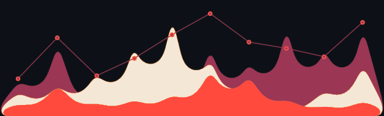

I am a Ph.D. student in Computer Science at the University of Utah, conducting research in LLM steering, wearable sensing, statistical algorithms, geospatial analytics, and scalable machine learning.

## 🚀 Selected Projects

- **[Efficient and Stable Multi-Dimensional Kolmogorov-Smirnov Distance (dKS)](https://arxiv.org/abs/2504.11299)** — A multidimensional extension of the Kolmogorov-Smirnov distance with efficient approximation algorithms and hypothesis-testing applications.
- **[LLM Steering and Dataset Corruption](https://arxiv.org/abs/2603.03206)** — Research on robustness in activation steering for large language models and the effects of dataset corruption.
- **[MotionPI](https://arxiv.org/abs/2510.19938)** — A full-stack wearable sensing platform built with Flutter, BLE wristband integration, and a Node.js/MongoDB backend.
- **[Region-Aggregated Spatial Scan Statistics](https://mmath.dev/pyscan/)** — Sampled-point methods for spatial anomaly detection with improved statistical power over centroid-based approaches.

## 🛠️ Open Source Contributions
- Reported and reproduced a Google Flutter SDK versioning bug: [Issue #166937](https://github.com/flutter/flutter/issues/166937), which was confirmed and triaged by the Google Flutter framework team (`triaged-framework`, `P2`).

## Skills

  
  
  
  
  
  
  
  
  
  
  
  

## Socials

  
  

  

